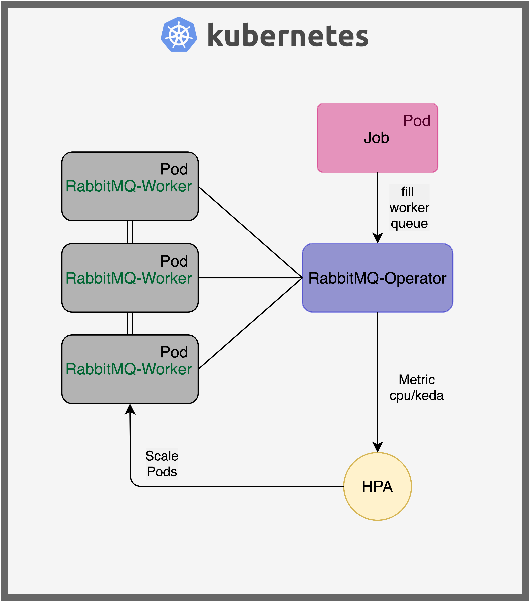

# Scale horizontally RabbitMQ workers on kubernetes cluster.

_Minimalist repository to scale with kubernetes some jobs published to a rabbitmq queue._

You will find **two auto-scaling strategies** on two different branches:

- hpa-cpu: Horizontal scaling based on worker pods cpu.
- hpa-keda: Horizontal scaling based on queue length.

  

## Project Goal

The main idea of this project is to used the power of k8s pods auto-scaling to deliver a higher speed than just parallelism on one machine. Indeed at a peek of messages, one machine ressources can easily be overwhelm. Also some task can't be parallelized on one machine due to limitation from external process, this is the case of downloading data from yahoo that will reduce the download rate by IP address.

In this example a worker receives a Nasdaq Symbol and download some data with yahoo-finance. When adding a massive amount of queue messages, multiple pods opens and performed this simple tasks at higher rate.

## Dependencies & installation

1. Install [Minikube](https://minikube.sigs.k8s.io/docs/start/), or other local Kubernetes cluster managers.

2. Install [RabbitMQ Cluster Operator](https://www.rabbitmq.com/kubernetes/operator/operator-overview.html). This Kubernetes software extension installs and manages our RabbitMQ broker.
`kubectl apply -f "https://github.com/rabbitmq/cluster-operator/releases/latest/download/cluster-operator.yml"`

3. Install [Keda](https://keda.sh/docs/2.0/).
`kubectl apply -f https://github.com/kedacore/keda/releases/download/v2.0.0/keda-2.0.0.yaml`

4. Install Make, in order to use our Makefile, which wraps up some frequent commands for this project.

## Set up your environment

_These instructions must be executed before testing the core project_
1. Start the VM hosting Minikube : `minikube start`,
2. Launch the dashboard to monitor all the created k8s objects `minikube dashboard`,
3. Tell the Docker cli to use the docker daemon running on your minikube VM; it is useful to develop locally. `eval $(minikube docker-env)`,
4. At the end, to stop the Minkube VM :   `minikube stop`.

## Main commands

_Those instructions are the targets of the Makefile_

1. Create the k8s **namespace** called rabbitmq : `make namespace`.
2. Deploy the RabbitMQ broker `make deploy-rabbitmq`
3. Check if the **rabbitmq-master** is correctly running with the [UI](http://localhost:15672). `make ui-rabbitmq`. User _guest_, password _guest_.
4. Deploy the **rabbitmq-worker** : `make deploy-worker`. (If made for the first time, buid the docker image)
5. Deploy the **hpa scaler** : `make scale-worker`
6. Launch the **job**, which loops over hundreds of stock data download instructions. `make launch-job`. (If made for the first time, buid the docker image)
