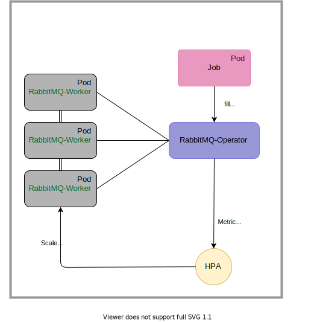

# RabbitMQ Horizontal-Scaling on kubernetes cluster.

Auto-scaling of consumers that receive messages from a RabbitMQ working queue filled by jobs. Two auto-scaling are implemented on two different branches.

- hpa-cpu: Horizontal scaling based on worker pods cpu.
- hpa-keda: Horizontal scaling based on queue length.

  

## Project Goal

The main idea of this project is to used the power of k8s pods auto-scaling to deliver a higher speed than just parallelism on one machine. In deed at a peek of messages, one machine ressources can easily be overwhelm. Also some task can't be parallelise on one machine due to limitation from external process, this is the case of downloading data from yahoo that will reduce the download rate by address IP

In this example a worker receives a Nasdaq Symbol and download some data with yahoo-finance. When adding a massive amount of queue messages, multiple pods opens and performed this simple tasks at higher rate.

## Prerequisites

1. Kubernetes cluster: Minikube for instance.
2. Registre docker pour minikube (qui tourne sur une VM hors de l'OS du host) `eval $(minikube docker-env)`

# Litterature
- Redis dashboard queue monitoring. (Redis+flask)[https://testdriven.io/blog/asynchronous-tasks-with-flask-and-redis-queue/]

- Explication avec du scaling (Java queue)[https://www.freecodecamp.org/news/how-to-scale-microservices-with-message-queues-spring-boot-and-kubernetes-f691b7ba3acf/]
